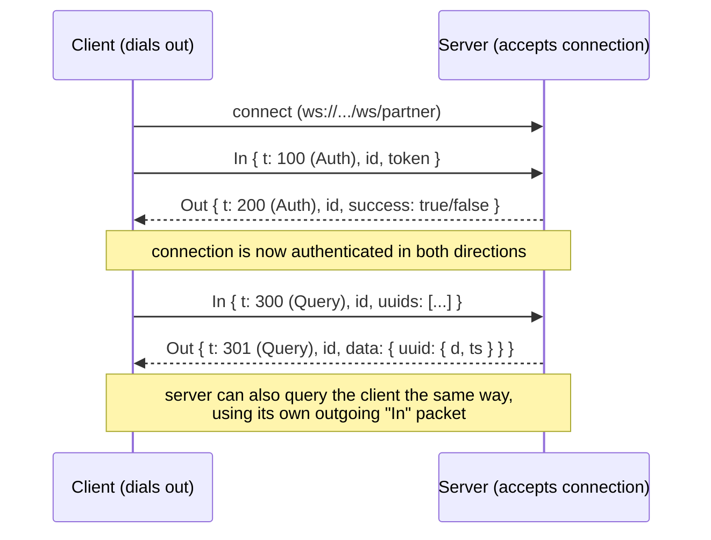

# Partner Cache Protocol

A WebSocket protocol for sharing cached [Hypixel](https://api.hypixel.net) SkyBlock profile
data between two independent backend services, so that both can reduce the use of thier
Hypixel API key if the other side already has the profile cached.

## Why this exists

Both services track SkyBlock player data and independently cache Hypixel's
`/v2/skyblock/profiles` response per player. Since the two services often request the
same players, most of that Hypixel traffic was
duplicated: two servers, two API keys. both fetching the exact same JSON.

Rather than merging infrastructure, we built peer-to-peer layer on top of each service's
existing cache:

- Each side keeps caching exactly like it did before.
- One side connects out to the other over a WebSocket and authenticates with a shared secret.
- Either side can then ask the other "do you have this UUID cached?" and get back cached Hypixel response.

## How it works



Full wire format and semantics are documented in [`PROTOCOL.md`](./PROTOCOL.md).

## Repo layout

```
server/    Server-side implementation (accepts the incoming WebSocket and handles auth and sends/answers queries)
client/    Client-side implementation (connects to the server side, authenticates and sends/answers queries)
example.kt a simple example usage
PROTOCOL.md  Wire protocol specification
```

## Design decisions

- **Raw response caching, not formatted output.** Lets both sides parse independently.
Caching the **raw** response from Hypixel means the two sides don't need to agree on data shape, only on "what did
Hypixel return for this UUID." Each service parses the raw JSON with its own existing logic.


- **Fetch time timestamps, not TTLs.** Each `Entry.timestamp` is the UTC time the data was
  originally fetched from Hypixel, not "seconds remaining." This lets the receiving side apply
  *its own* staleness rules instead of trusting the sender's cache policy.


## Authors

- [Noamm9](https://github.com/Noamm9): client implementation, protocol co-design
- [skies-starred](https://github.com/skies-starred): server implementation, protocol co-design