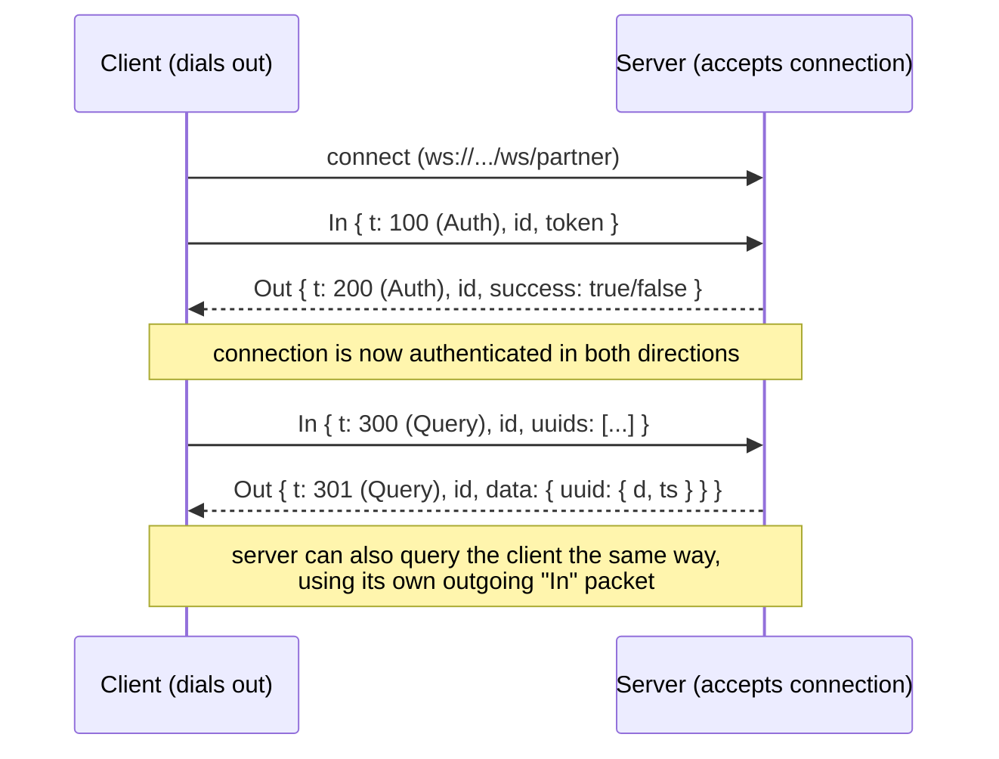

# Partner Cache Protocol

A small WebSocket protocol for sharing cached [Hypixel](https://api.hypixel.net) SkyBlock profile
data between two independently-run backend services, so that neither side has to burn its own
Hypixel API key re-fetching a profile the other side already has cached.

## Why this exists

Both services track SkyBlock player stats and independently cache Hypixel's
`/v2/skyblock/profiles` response per player. Since the two services often get queried for the
same players, most of that Hypixel traffic was duplicated: two servers, two API keys, two rate
limits, fetching the exact same JSON.

Rather than merging infrastructure, we built a thin peer-to-peer layer on top of each service's
existing cache:

- Each side keeps caching exactly like it did before (Redis, TTL-based).
- One side connects out to the other over a WebSocket and authenticates with a shared secret.
- Either side can then ask the other "do you have this UUID cached?" and get back the **raw**
  Hypixel response (not a formatted/derived one) if so.
- A miss on both sides falls through to a real Hypixel API call, same as always.

Caching the *raw* Hypixel response (rather than each service's own formatted output) was a
deliberate choice — it means the two sides don't need to agree on data shape, only on "what did
Hypixel return for this UUID." Each service parses the raw JSON with its own existing logic.

## How it works



Full wire format and semantics are documented in [`PROTOCOL.md`](./PROTOCOL.md).

## Repo layout

```
server/    Server-side implementation (accepts the incoming WebSocket, handles auth + queries)
client/    Client-side implementation (dials out, authenticates, sends/answers queries)
PROTOCOL.md  Wire protocol specification
```

Each side implements the packet types independently, in its own codebase's package namespace —
the contract between them is the JSON shape (field names via `@SerialName`), not shared code.
That's intentional: either service can evolve its internals freely as long as the wire format
stays compatible.

## Key design decisions

- **Raw response caching, not formatted output.** Lets both sides parse independently.
- **Fetch-time timestamps, not TTLs.** Each `Entry.timestamp` is the UTC time the data was
  originally fetched from Hypixel, not "seconds remaining." This lets the receiving side apply
  *its own* staleness rules instead of trusting the sender's cache policy.
- **Correlation IDs on every packet**, since a single WebSocket connection carries requests and
  responses in both directions concurrently.
- **Exponential backoff with jitter** on reconnect, so a dead peer doesn't get hammered.
- **Symmetric protocol.** Both `Auth`/`Query` request and response shapes are shared types
  (`In`/`Out`), so the same packet definitions work regardless of who initiated the query.

## Status

This is a working integration between two independently-operated SkyBlock stat-tracking
services. Published here mainly for documentation and reference — it's tailored to both
services' existing internals (Redis keying, Hypixel response shape, etc.) rather than meant as a
drop-in general-purpose library.

## Authors

- [Noamm9](https://github.com/Noamm9) — client implementation, protocol co-design
- [skies-starred](https://github.com/skies-starred) — server implementation, protocol co-design
